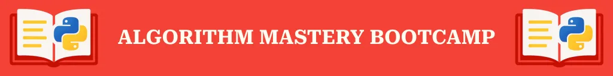

If you’ve been wanting to finally feel confident tackling algorithmic problems, sharpen your Python skills, and learn to think like a real programmer & problem-solver, this is your chance.

Over **12 days**, you’ll solve **24 real programming challenges**.

Each day, you’ll strengthen your problem-solving muscles and learn how to structure and debug your own code _without relying on AI tools to do the thinking for you_.
