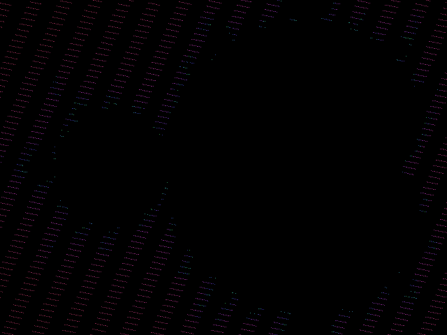

Learn how to define some fractals rigorously and draw them with Python or APL.

===

# Purpose

The aim of this workshop is to show people what the [Mandelbrot]
fractal really is and how to compute it.
Not only that, but we also use Python to create a rendering of the Mandelbrot
set like the one shown below:

The program we will write together can zoom in on arbitrary points when
you click the fractal, can save screenshots and can even save all the frames it
generates, so you can create a GIF like the one above.

# Content

During this workshop I teach you how the Mandelbrot set is defined in
mathematical terms and then we go over that definition together, to turn it into
something that a computer program can compute.

We will be working on our program incrementally, so you'll go through many
different renderings of the Mandelbrot set:

# Takeaways

If you pay enough attention and if I do my job well enough, by the time the
workshop is over, you'll have

 - understood the inner workings of a fractal, from the mathematical point
   of view;
 - created a program that can compute if a point belongs to the Mandelbrot
   set or not;
 - understood how to create a program that takes a long time to run but
   keeps updating the user with information;
 - created a progressive rendering of the Mandelbrot set.

# Feedback

Here is what some participants had to say about the workshop:

 > “*Really informative, useful and interesting. We learned a lot given the time we had and the availability to answer questions (while also motivating others to chip in) created an amazing environment.*” – João F.

<!---->

 > “*It was relaxed, fun and you made everyone feel comfortable (only good vibes!). You explained what we were doing well and the final result looked cool.*” – Inês G.

# Past sessions

 - Ad-hoc workshop organised with iNIGMA, a student union of maths students from FCUP, Portugal, on the 11th of December of 2020.

# Useful links

 - reference code for this workshop can be found at [my GitHub workshops
repository][workshops-gh].
 - [Couple of blog posts][fractals-blog] that deal with fractals and
drawing them.

[workshops-gh]: https://github.com/RojerGS/workshops
[Mandelbrot]: /blog/fractals-and-mandelbrot-set
[fractals-blog]: /blog/tag:fractals
