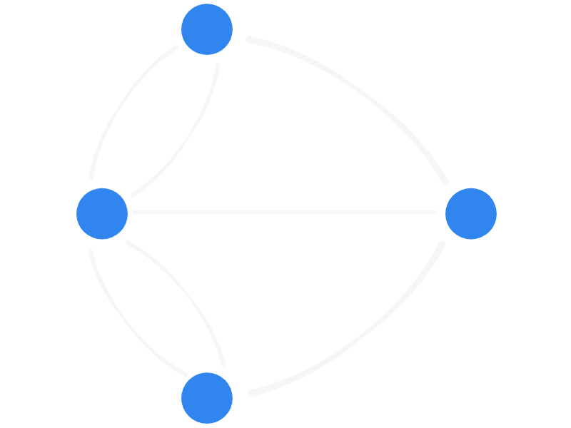

Resolve uma série de problemas que não aparentam estar relacionados
e maravilha-te com a elegância da matemática que rege as suas soluções.

===

# Objetivo

O objetivo deste workshop é expor os participantes a vários puzzles que parecem bastante simples para depois lhes mostrar que a matemática tem sempre uma palavrinha a dizer.

# Conteúdo

Este workshop é apropriado para _todas_ as idades. Claro que em função da faixa etária da minha audiência e do tempo que eu tenho, eu escolho alguns quebra-cabeças e depois sigo os seguintes passos:

 1. mostro um quebra-cabeças que pode ser resolvido facilmente;
 2. peço aos participantes que tentem resolver puzzles semelhantes (... com a particularidade de incluir alguns puzzles impossíveis!);
 3. gero um debate sobre se os puzzles são possíveis de resolver (e a audiência tem só falta de jeito) ou se são mesmo impossíveis;
 4. uso matemática para provar que os quebra-cabeças são mesmo impossíveis.

Os quebra-cabeças que eu escolho costumam estar relacionados com teoria de grafos, mas isto acontece principalmente porque teoria de grafos está escondida em todo o lado. Um exemplo de um problema de que costumo falar muitas vezes é o d'[as sete pontes de Königsberg](https://en.wikipedia.org/wiki/Seven_Bridges_of_K%C3%B6nigsberg).

# Sessões passadas

 - Dei este workshop 4 vezes em 2019 e confesso que foi sempre um sucesso.
