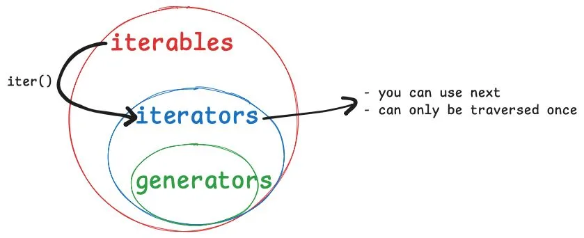

# 🐍🚀 iterators, next, generators, and the like

 > This is a past issue of the [mathspp insider 🐍🚀](/insider) newsletter. [Subscribe to the mathspp insider 🐍🚀](/insider) to get weekly Python deep dives like this one on your inbox!

## Publishing meetup events

For the past few months I have been [co-organising the Python Lisbon Meetup](https://python-lisbon-meetup.github.io) with a few friends.

Every time we meet, we add the event to the meetup website, so we keep a history of all the events.

They most recent events have titles that look like this:

 - 08 PyLM Meetup at Técnico
 - 07 PyLM Meetup at Técnico
 - 06 PyLM Meetup at Técnico
 - ...

As you can see, we keep track of a counter for each meetup.

Here's the counter implementation in Python.

## The meetup counter

```py
class MeetupCounter:
    def __init__(self):
        self.at = 0

    def next_idx(self):
        self.at += 1
        return self.at

meetup_counter = MeetupCounter()
print(meetup_counter.next_idx())  # 1
print(meetup_counter.next_idx())  # 2
print(meetup_counter.next_idx())  # 3
```

The class `MeetupCounter` keeps track of the last meetup in the attribute `at`.

When you want the next index, you increment the attribute and return the new value.

## The built-in `next`

But Python has a built-in called `next`.

It's useful for things that produce values in sequence.

Using the built-in `next` allows you to fetch the _next_ element.

How can you make your counter work with the built-in `next`?

Well, you just need to use the method name `__next__` instead of `next_idx`:

```py
class MeetupCounter:
    def __init__(self):
        self.at = 0

    def __next__(self):
        self.at += 1
        return self.at

meetup_counter = MeetupCounter()
print(next(meetup_counter))  # 1
print(next(meetup_counter))  # 2
print(next(meetup_counter))  # 3
```

By using the dunder method `__next__`, the built-in `next` automatically knows how to fetch the next value.

But to be honest with you, we only added this meetup history _today_.

Literally.

So we already had some meetups to publish.

## Adding many meetups at once with a loop

What I did was collect all titles in a list:

```py
titles = ["Past meetup", "Another past meetup", "..."]
```

Now, I wanted to use a `for` loop and the built-in `zip` to build all the complete titles with indices.

Something like this:

```py
meetup_counter = MeetupCounter()

for idx, title in zip(meetup_counter, titles):
    print(idx, title)
```

But this code doesn't work.

You get a `TypeError`: the object `meetup_counter` of the type `MeetupCounter` is _not_ iterable...

What is it missing?

## What's an iterable?!

A Python object is considered an **iterable** if it has a dunder method `__iter__` that returns an object that _knows_ how to produce elements in succession.

But wait...

The `MeetupCounter` class knows how to produce elements in succession!

The `MeetupCounter` class has the dunder method `__next__` already, remember?

So, you just need to add the dunder method `__iter__` that returns the object itself:

```py
class MeetupCounter:
    def __init__(self):
        self.at = 0

    def __next__(self):
        self.at += 1
        return self.at

    def __iter__(self):
        return self
```

By returning itself, you can now use meetup counters in `for` loops:

```py
meetup_counter = MeetupCounter()
titles = ["Past meetup", "Another past meetup", "..."]

for idx, title in zip(meetup_counter, titles):
    print(idx, title)
```

This code produces the following output:

```text
1 Past meetup
2 Another past meetup
3 ...
```

This is pretty cool, right?

## The counter is an iterator

The technical term for the meetup counter is an **iterator**.

Iterators are objects that have the two dunder methods `__iter__` and `__next__`.

So, `MeetupCounter` is an iterator.

But looking at the class, it's a lot of lines of code for something that's so “simple”.

You just starting counting at 1 and you keep going up.

Why do you need to have three dunder methods, especially when `__iter__` seems like it's doing _nothing_..?

## Generators are shortcuts to create iterators

Generator functions are the Pythoh shortcut to create iterators.

You don't need to have a class with `__iter__` returning itself and the dunder method `__next__` implementing some logic.

You can just write a generator function that mimics `__init__` and `__next__` together:

```py
def meetup_counter_gen():
    at = 0
    while True:
        at += 1
        yield at
```

The keyword `yield` magically turns `meetup_counter_gen` into a **generator function**.

When you call it, you get a generator:

```py
print(meetup_counter_gen())  # <generator object meetup_counter_gen>
```

This generator can also be used with the built-in `next` or in a loop.

A generator _is_ an iterator:



Not all iterators are generators.

But all generators are iterators.

After all, generators are a shortcut to create iterators.

## What are iterables, then?

There's a part of the diagram above that I left unexplained.

Iterables and the built-in `iter`.

Let's talk about them next week.

## Enjoyed reading? 🐍🚀

Get a Python deep dive 🐍🚀 every Monday by dropping your best email address below:


