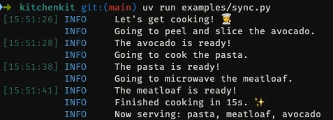
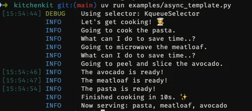

# 🐍🚀 New package: kitchenkit

 > This is a past issue of the [mathspp insider 🐍🚀](/insider) newsletter. [Subscribe to the mathspp insider 🐍🚀](/insider) to get weekly Python deep dives like this one on your inbox!

## Cooking with `asyncio`

Yesterday I gave a live workshop about `asyncio`:

 - teaching how to think about asynchronous code
 - how to define and run coroutines
 - how to synchronise your code
 - and more

And ultimately, the final objective was to create a multi-user asynchronous chat app.

To get there, I needed to teach the basics of asynchronous code.

And if you've been reading this newsletter for a while, you might've read about it before...

But I like to explain `asyncio` with a cooking analogy.

And that's where the new package `kitchenkit` comes in.

## `kitchenkit`

The package `kitchenkit` was designed to be a tool you can use when teaching `asyncio`.

I intend to write about it in greater detail _eventually_, but there's no telling how long that'll take.

The package can be installed with `python -m pip install kitchenkit` or with `uv add kitchenkit`.

The GitHub repository is here: https://github.com/rodrigogiraoserrao/kitchenkit.

You can take a look around and possibly poke at the folder `examples`, that shows some examples of instructive code snippets you can write with `kitchenkit`.

Now, the thing is that `kitchenkit` is a _teaching aid_.

You still need to be taught how `asyncio` works, you won't magically learn how it works just by looking at the package `kitchenkit`.

## Learn how to think about async code

I ran a live workshop yesterday about `asyncio` where we used `kitchenkit`.

The recording is already available to be watched by those who purchased access.

But because of a mistake I made with timezones, I'll do a rerun of the workshop on the 29th of June, at 3pm UTC.

If you want to watch the recording, or if you want to join the workshop on the 29th, [follow this link](https://mathspp.gumroad.com/l/cooking-with-asyncio?layout=profile).

If you're interested in some of the other workshops I'm leading this week and the next, there's also an “All access pass” that gives you access to 15h of Python training for just $99: [learn more about the all access pass](https://mathspp.gumroad.com/l/live-workshop-free-pass?layout=profile).

## The basic `kitchenkit` template

The idea of `kitchenkit` is that by using `asyncio`, you can manage your kitchen more efficiently.

Thus, you use `kitchenkit` to cook a meal and you see a log of your activities, the time each is taking, and the total prep time when you're done.

For example, here's a meal being cooked with _synchronous_ code:

```py
from kitchenkit import put_on_apron, serve_food
from kitchenkit.leftovers import Meatloaf
from kitchenkit.pantry import Avocado, Pasta
from kitchenkit.prep import peel_and_slice, microwave, cook

def main():
    put_on_apron()
    avocado = peel_and_slice(Avocado())
    pasta = cook(Pasta())
    meatloaf = microwave(Meatloaf())
    serve_food(pasta, meatloaf, avocado)

if __name__ == "__main__":
    main()
```

If you run this code, you get the following output:



The functions `put_on_apron` and `serve_food` start and stop the timer, respectively, and they show you took 17 seconds to prep your meal.

If you use the asynchronous functions to microwave and cook, though, you can get your meal ready in just 10 seconds:

```py
import asyncio

from kitchenkit import put_on_apron, serve_food
from kitchenkit.leftovers import Meatloaf
from kitchenkit.pantry import Avocado, Pasta
from kitchenkit.prep import peel_and_slice
from kitchenkit.async_prep import microwave, cook

async def async_peel_and_slice(food):
    return peel_and_slice(food)

async def main():
    put_on_apron()
    food = await asyncio.gather(
        cook(Pasta()),
        microwave(Meatloaf()),
        async_peel_and_slice(Avocado())
    )
    serve_food(*food)

if __name__ == "__main__":
    asyncio.run(main())
```

If you run this code, you get a different output showing that you were smarter about the way your tasks are managed:



## Synchronisation primitives

Most people only have one microwave at their place.

The package `kitchenkit` also emulates that!

Suppose you try microwaving two things at the same time:

```py
import asyncio

from kitchenkit import put_on_apron, serve_food
from kitchenkit.leftovers import Bulgur, Meatloaf
from kitchenkit.async_prep import microwave

async def main():
    put_on_apron()
    food = asyncio.gather(
        microwave(Meatloaf()),
        microwave(Bulgur()),
    )
    serve_food(*food)

if __name__ == "__main__":
    asyncio.run(main())
```

If that happens, you get an error:

```text
kitchenkit.exceptions.MessyKitchenError: There's already something in the microwave!
```

You can use this to teach how to use locks, for example.

You need to create a lock that you put around your calls to `microwave(Meatloaf)` and `microwave(Bulgur)` so that only one can run at a time.

Your code would become something like

```py
microwave_lock = asyncio.Lock()

async def microwave_meatloaf():
    async with microwave_lock:
        return await microwave(Meatloaf())

async def microwave_bulgur():
    async with microwave_lock:
        return await microwave(Bulgur())

async def main():
    put_on_apron()
    food = await asyncio.gather(
        microwave_meatloaf(),
        microwave_bulgur(),
    )
    serve_food(*food)
```

And there's a similar limitation with the function `cook`.

If you only have two pots but need to cook 3 or more items, how can you do that?

You use a semaphore!

And you can use `kitchenkit` for that.

All of these things I'm mentioning [live in the folder `examples`](https://github.com/rodrigogiraoserrao/kitchenkit/tree/main/examples), so feel free to take a look at those.

## Feedback?

If you have any feedback regarding the package, like ideas of more things that could be added to teach other concepts, reply to this email.

## Enjoyed reading? 🐍🚀

Get a Python deep dive 🐍🚀 every Monday by dropping your best email address below:


