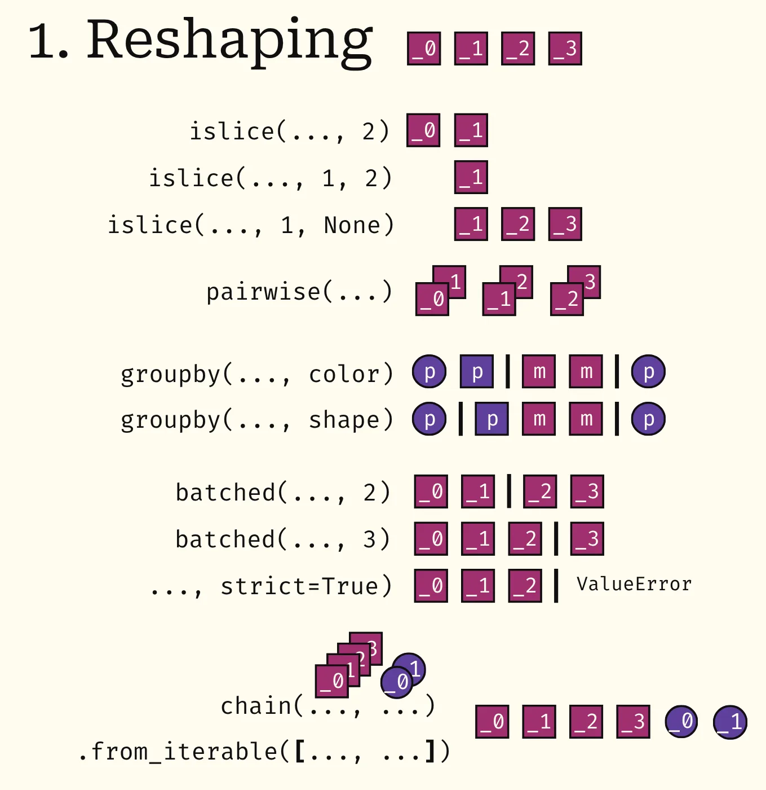
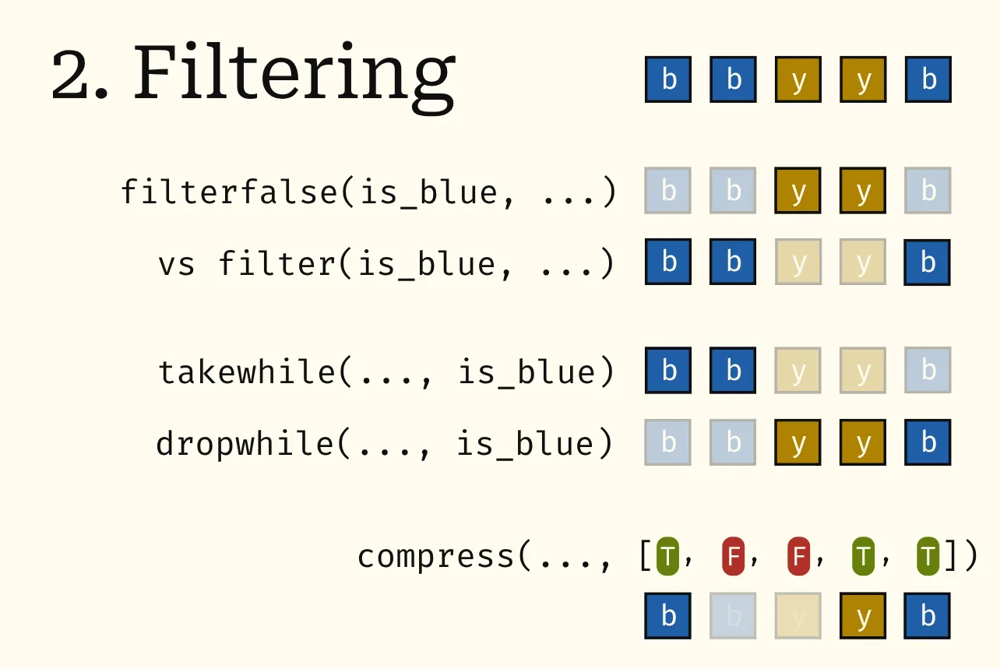
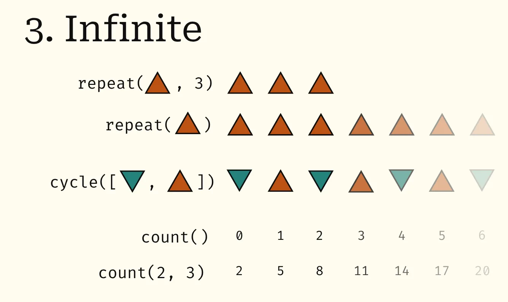
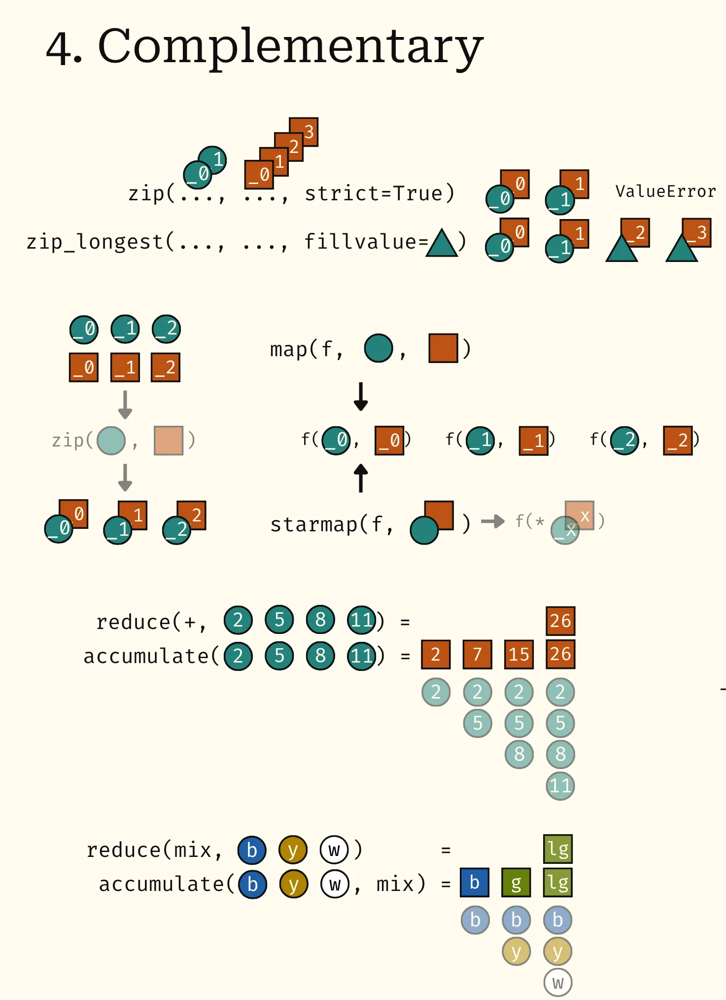
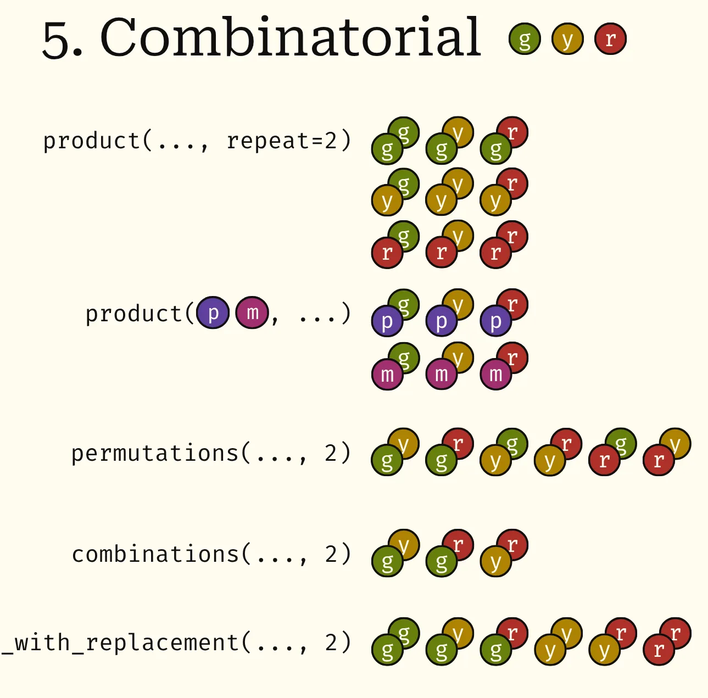

# 🐍🚀 itertools, explained with diagrams

 > This is a past issue of the [mathspp insider 🐍🚀](/insider) newsletter. [Subscribe to the mathspp insider 🐍🚀](/insider) to get weekly Python deep dives like this one on your inbox!

## Categorising `itertools`

First things first, we're going to split the iterables from `itertools` into 5 categories:

 1. reshaping
 2. filtering
 3. infinite
 4. complementary
 5. combinatorial

Now, for each category I'll present a collection of diagrams that explains the iterables from that category.

Ideally, the diagrams are self-explanatory.

If something doesn't make sense or isn't clear, reply to let me know!

I'd be happy to improve the cheatsheet and the diagrams.

## Reshaping

## Filtering

## Infinite

## Complementary

## Combinatorial

**Note**: the last iterable's full name is `combinations_with_replacement`.

## `tee`

The module `itertools` also gives you access to the function `tee`.

You use it to work with iterables but it's not an iterable in and of itself, which is why it's not included in these diagrams.

## Enjoyed reading? 🐍🚀

Get a Python deep dive 🐍🚀 every Monday by dropping your best email address below:


