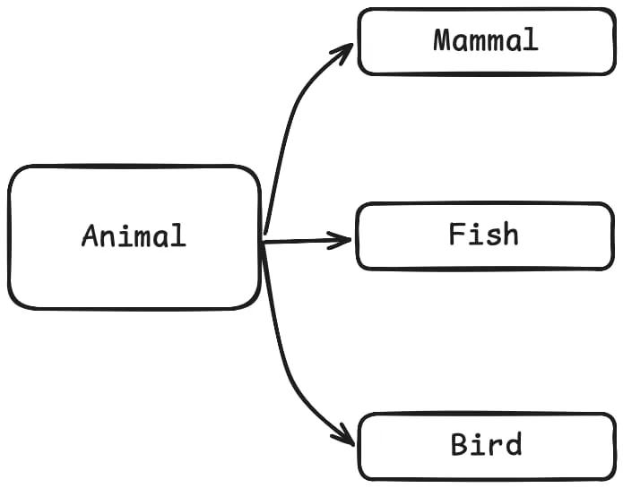
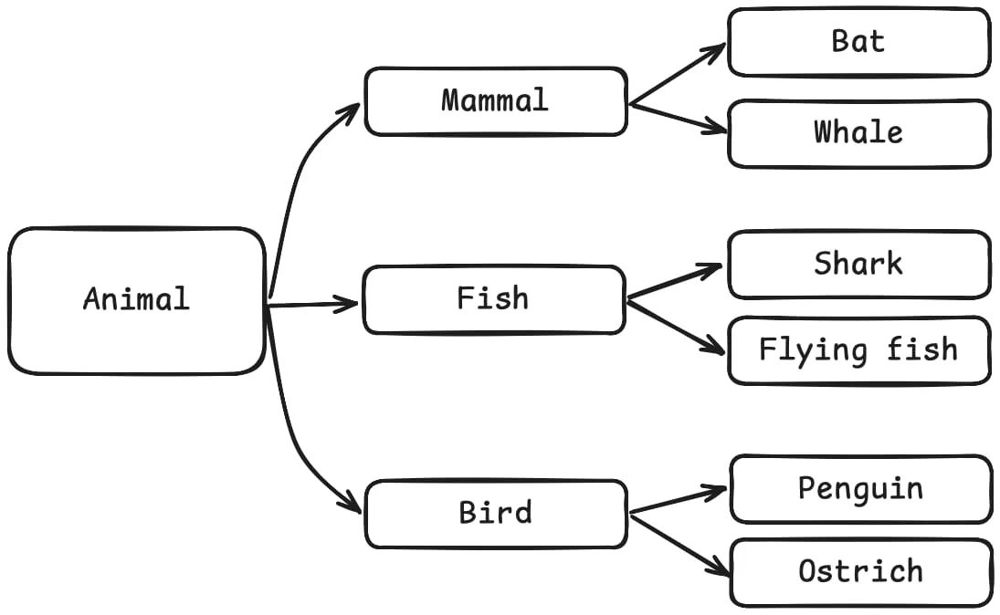

---
metadata:
    description: "Read a short but clear explanation of what protocols are in Python and how to use them in this sample of the mathspp insider weekly newsletter."
title: Understand protocols in 180 seconds
---

# 🐍🚀 understand protocols in 180 seconds

 > This is a past issue of the [mathspp insider 🐍🚀](/insider) newsletter. [Subscribe to the mathspp insider 🐍🚀](/insider#subscribe) to get weekly Python deep dives like this one on your inbox!

Start the clock. ⏰

## Earth simulation

I'm currently working on a massive project.

A simulation of our planet Earth and its living beings.

Right now, I'm working on animals.

Trying to figure out how to set up everything...

What classes to create, what methods to give each class, the hierarchy tree, etc.

For now, I'm thinking of creating a class `Animal` and then create classes like `Mammal`, `Fish`, and `Bird`, that inherit from `Animal`:



## The methods in these classes

I'm pretty happy with this hierarchy.

It matches what biologists do, so it makes sense to me.

Now I'm tinking about the methods I'm going to give to each.

My animals need to be able to move around in the simulation, right?

And when I think about fish, I think about animals swimming around.

And when I think about birds, I think about animals with wings flying around.

And when I think about mammals, I think about 4-legged animals walking around.

So, I considered these methods:

 - `Mammal` – `.walk` and `.run`
 - `Fish` – `.dive` and `.swim`
 - `Bird` – `.take_off`, `.fly`, and `.land`

## The hierarchy + methods don't hold up

I was happy with those methods for a whole 5 seconds.

Why?

Because then I added some animals, and things quickly started breaking:



Can you see what the problem is, already?

I thought about adding the methods `.walk` and `.run` to the class `Mammal`, but can whales run?

The ability to walk is a behaviour that some animals exhibit.

And exhibiting this behaviour is orthogonal to the hierarchy.

Same thing with flying and swimming.

Not everything that swims is a fish.

I swim and I'm not a fish!

Not everything that flies is a bird.

And some birds don't even fly!

## Protocols describe behaviours

A protocol, in Python, is a way to formally define a set of behaviours (methods) that are relevant.

For example

 - animals with the methods `.walk` and `.run` are “walkers”;
 - animals with the methods `.dive` and `.swim` are “swimmers”; and
 - animals with the methods `.take_off`, `.fly`, and `.land`, are “flyers”.

That should be a much more accurate representation of the animal kingdom:


## A protocol is a name for a set of behaviours

When you write a function that expects a “swimmer”, it doesn't matter if it's a mammal, like the whale, a bird, like the penguin, or a fish.

If it swims, it's good enough!

That's why in Python you always hear “if it walks like a duck and if it quacks like a duck, it must be a duck”.

Duck typing refers to this idea that unrelated objects might have methods in common.

For example, sharks, whales, and penguins, know how to swim.

Protocols are just a way to formalise this idea.

In Python, you'd implement the swimmer protocol by using `typing.Protocol` and defining the signatures of the methods you need:

```python
from typing import Protocol

class Swimmer(Protocol):
    def dive(self, depth): ...
    def swim(self, to): ...
```

Now, every object that has the methods `.dive` and `.swim` is considered a swimmer.

To “use” a protocol, you don't inherit from it.

Protocol usage is implicit.

Here's a class `Submarine` that implements the `Swimmer` protocol:

```python
class Submarine:
    def dive(self, depth):
        print(f"Submarine diving to {depth = }.")

    def swim(self, to):
        print(f"Sub going at full speed {to = }.")
```

Notice that `Submarine` does not inherit from `Swimmer`.

And notice that submarines are completely orthogonal to the class hierarchy we were discussing...

And yet, the class `Submarine` fits in here!

We say that the class `Submarine` implements the protocol `Swimmer` because of structural subtyping: the class `Submarine` has the necessary structure (methods) to be handled like any other `Swimmer` object.

## Protocol usage in type checking

Protocols are used explicitly in type hints, though:

```python
def underwater_scenic_route(visitor: Swimmer) -> None:
    # Admire the corals
    visitor.dive(30)
    visitor.swim("corals")
    # Check the shipwreck
    visitor.dive(45)
    visitor.swim("shipwreck")
```

The type hint `visitor: Swimmer` tells type checkers that the variable visitor holds an object that defines the methods `.dive` and `.swim`.

Therefore, if you pass it a `Whale`, a `Shark`, a `Penguin`, or a `Submarine`, the function will always type-check.

## Comprehension check

Did this make sense?

The key points here are that

 - protocols prescribe a number of methods that represent behaviour;
 - protocols are not used explicitly in the class hierarchy; in fact
 - protocols might span unrelated class hierarchies;
 - protocols are used explicitly as type hints; and
 - we say that `Submarine` implements the protocol `Swimmer` because it implements all methods listed in the protocol.

Reply to this email with any questions you might have.


## Enjoyed reading?

This is a past issue of the [mathspp insider 🐍🚀](/insider) newsletter.
Subscribe to the mathspp insider 🐍🚀 to get weekly Python deep dives like this one on your inbox:

[Join mathspp insider 🐍🚀](/insider?classes=btn,btn-lg,btn-center#subscribe)
