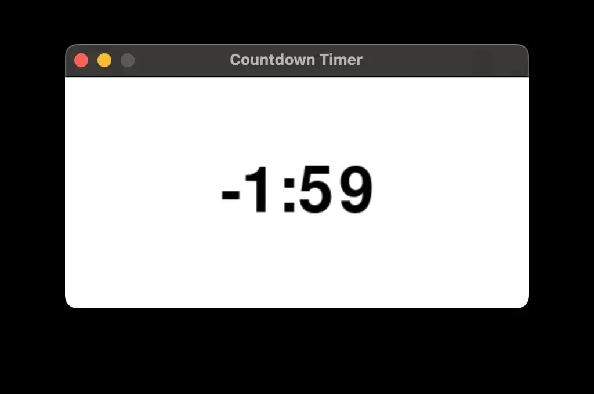

# 🐍🚀 how to use ChatGPT for Python code

 > This is a past issue of the [mathspp insider 🐍🚀](/insider) newsletter. [Subscribe to the mathspp insider 🐍🚀](/insider#subscribe) to get weekly Python deep dives like this one on your inbox!

## The countdown timer

The other day I was giving a Polars training and I needed a countdown timer so people knew how long they had to solve the exercises.

I asked ChatGPT for a Python + pygame script that showed a countdown timer and I got something quite decent:


GIF animation of a black countdown timer going from 02:59 to 02:56 in a white background.

I skimmed through the code and it looked good, so I was quite happy about it.

Until I wasn't.

The countdown went down to `00:02`, `00:01`, `00:00`...

And then it jumped to `-1:59`, where it stopped:



Which means I had to go and dig for the bug.

ChatGPT gets me 80% there...

But the remaining 20% are annoying as hell.

So far, this has been my experience with ChatGPT and other LLMs.

When I ask them for code, I get code that looks good but that sooner or later blows up in my face.

(One time, I asked for a standard implementation of a standard graph algorithm: depth-first search.

There are thousands of these online.

ChatGPT produced one that had a nasty mutability bug that took me a while to debug...)

This time, it was the way ChatGPT was doing computations with the time.

Like, the operations made no sense.

If it's `18:11:23` and I set a timer for 3 minutes, the timer should be up at `18:14:23`, that's it.

At each point, check how many seconds are left until `18:14:23` and present the numbers based on that!

Instead, ChatGPT was doing some silly computations at each frame.

What I tend to see is that the bugs are particularly infuriating because they're a type of bug I would “never” do.

(Probably, I would. I just like to think I wouldn't.)

After the initial prompt, a few follow-up prompts, and some manual fixing and tweaking, I concluded that it was great to have ChatGPT produce most of the boilerplate for the timer and to get something that almost worked.

Then, I had to fix a couple of bugs by prompting a bit more and in the end it was easier to just add a bit of extra functionality by hand.

Given this experience, that I've had repeatedly, I think I figured out my best use case for ChatGPT: quickly prototyping boilerplate.

And then I implement the features myself.

For example,

 - I've used ChatGPT to produce the boilerplate for a CLI app that uses Click and it set up the structure of the commands and arguments, but then I implement the argument functionality myself.
 - I've used ChatGPT to produce the boilerplate of this pygame program for the countdown timer but then I added some features myself.
 - I've used ChatGPT to produce the boilerplate for a pandoc filter (something I use when publishing my books) but then I implemented the algorithm inside the filter myself.

Is this similar to your experience with ChatGPT and other LLMs?

How do you use them?

## uv wizardry

In the end of the countdown timer adventure, I took the countdown timer and I put the code online.

I wrote a short blog post telling this ChatGPT story in more detail and I “attached” the code for the timer to that article in this URL: [https://mathspp.com/blog/using-an-llm-to-write-a-countdown-timer/cd.py](https://mathspp.com/blog/using-an-llm-to-write-a-countdown-timer/cd.py).

If you click the link, it should open the source code.

If you look closely, here is what the first few lines of the script look like:

```py
#!/usr/bin/env -S uv run
# /// script
# requires-python = ">=3.13"
# dependencies = [
#     "pygame",
# ]
# ///
```

The very first line is a shebang that lets me use the script as an executable that runs through `uv`, and the following lines (from `/// script` to `///`) are a header that `uv` added to the file.

What does that header do?

It tells `uv` the Python version that the script runs on and its dependencies, so that the script is a standalone script.

If the code of the script is in the file `timer.py`, then running `uv run timer.py` will tell `uv` to run your script, and because of the header it will install `pygame` in an isolated environment in order to run your code.

Additionally, if you give it executable permissions (with `chmod +x timer.py`, for example), you can just run `./timer.py`.

For the timer, specifically, you need to specify the number of minutes as an extra argument, so you'd do `uv run timer.py 3` or `./timer.py 3` with executable permissions.

`uv` is SO cool, that if you have it installed, you can even run my timer directly from the internet, with

```
uv run https://mathspp.com/blog/using-an-llm-to-write-a-countdown-timer/cd.py 3
```

Learn more about this usage of `uv` in this article: [https://mathspp.com/blog/til/standalone-executable-python-scripts-with-uv](https://mathspp.com/blog/til/standalone-executable-python-scripts-with-uv)


## Enjoyed reading?

This is a past issue of the [mathspp insider 🐍🚀](/insider) newsletter.
Subscribe to the mathspp insider 🐍🚀 to get weekly Python deep dives like this one on your inbox:

[Join mathspp insider 🐍🚀](?classes=btn,btn-lg,btn-center#subscribe)
