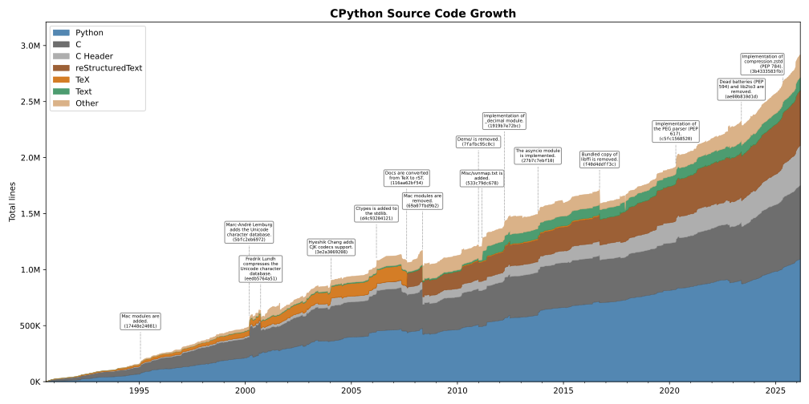

Stan Ulbrych produced this neat SVG showing the growth of the CPython repo over the past 36 years:

It is interesting to see some of the tags added, for example the 2nd and 3rd notes that mark a big bump and a big decrease in the code size when the Unicode character database is added to CPython and then compressed, respectively.
