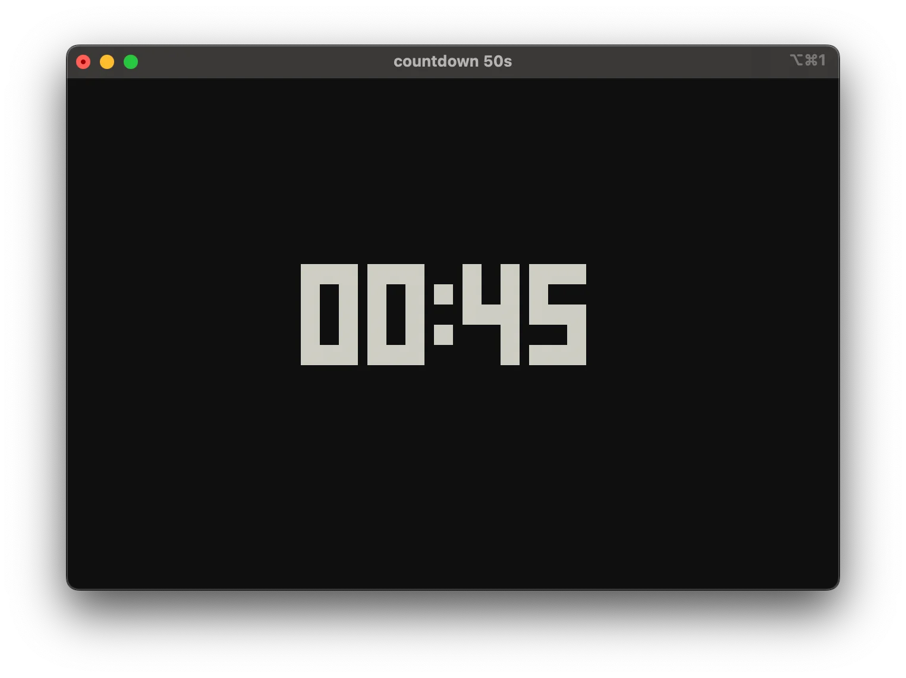

This Python package by Trey Hunner can be used from the command line to display a basic countdown timer in the terminal window.
Installing it with `uv tool install countdown-cli`, I got the `countdown` command that I can run with `countdown 50s`, or `countdown 5m`, or `countdown 3m30s`:

