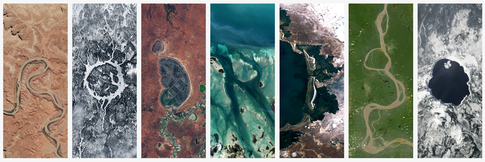
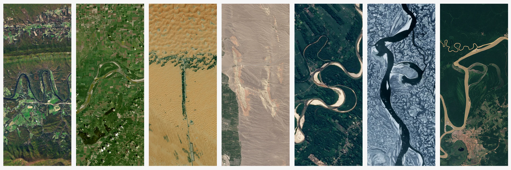

This page from NASA lets you type any word (they suggest you type your name) and the page will then spell out your name with satellite imagery from the Earth.

I gave it a spin with my name (Rodrigo) and with this website's name (mathspp):

