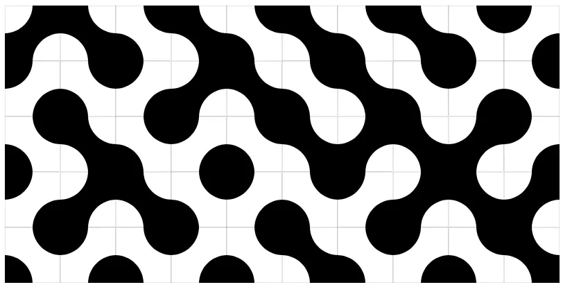

This article by Ned shows us what Truchet tiles are.
Tiles that can be placed randomly to tile a rectangular area and that yet produce beautifil smooth patterns.

A basic example of a Truchet tiling, taken from the linked article:

Ned goes on to share the code he wrote to produce Truchet tilings of all sorts, going into multiscale Truchet tilings (where certain tiles are subdivided recursively) or using Truchet tiles to recreate pictures.

The article is great and Ned also links to his code and notebooks that you can use to generate your own multiscale or image-based Truchet tilings.
Go read the article, or at the very least look at the pictures!
