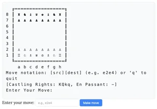

At the top of this article you are presented with a very basic rendering of a chess board and an input field where you're supposed to type chess moves:

Although this chess engine isn't very smart, since it fell for [the Scholar's mate](https://www.chess.com/article/view/the-4-move-checkmate) after checking me with a rogue bishop, the part of the engine that is computing what move to play is a series of 84,688 regular expressions...
The full explanation of how the engine works is brilliant and is available immediately under the chessboard.
For reference, I did beat the engine when I played 5. Qxf7#:

