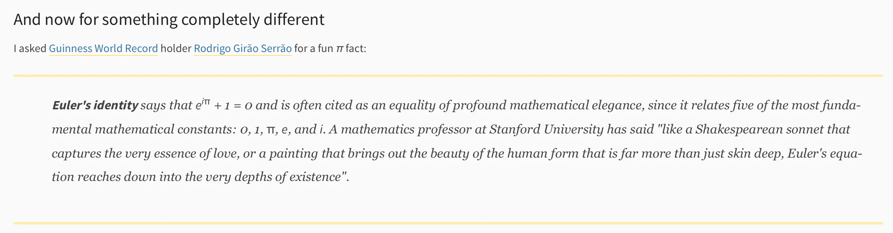

This is a link to the Python 3.14.5 release notes, which have nothing particularly exciting except the fact that in the section “And now for something completely different” they quote me with a nice π fact:

