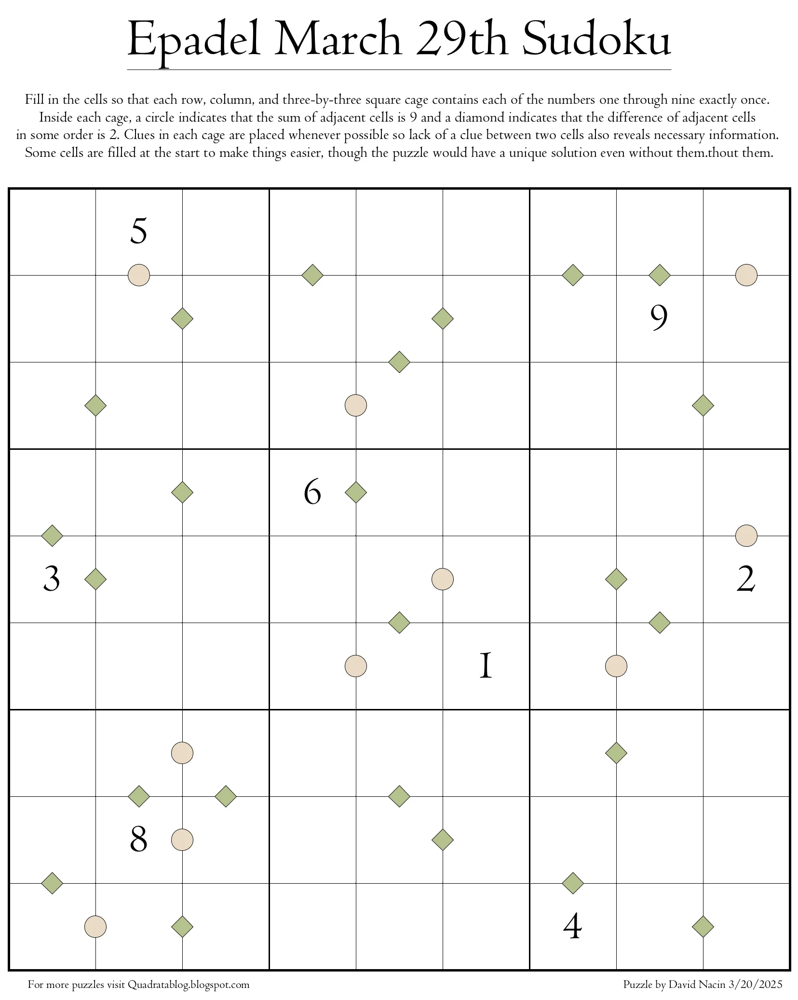

A fun Sudoku variant puzzle created by someone I met at EuroPython.
All Sudoku rules apply, plus:

 - If two adjacent cells add up to 9, a circle is placed between the two cells.
 - If two adjacent cells have a difference of 2, a diamond is placed between the two cells.

The original link contains a harder puzzle, if you like solving this one.
