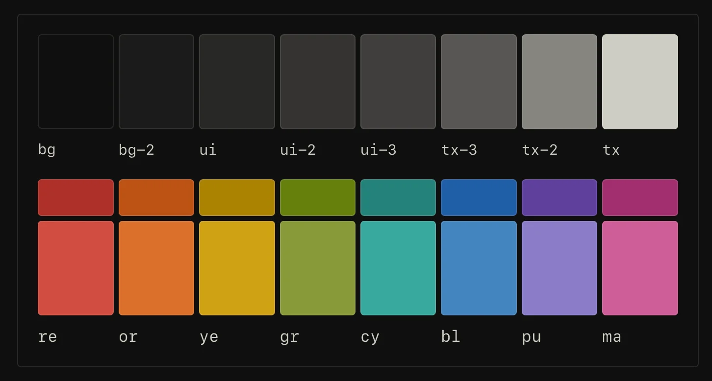

Steph Ango, the author of Obsidian, writes about Flexoki in this link, “an inky color scheme for prose and code. Flexoki is designed for reading and writing on digital screens. It is inspired by analog inks and warm shades of paper.”.

From time to time I like to give my website a fresh coat of paint and I'm wondering whether I'll be using the Flexoki colour scheme or not.

I included the base colour palette here, for reference:

