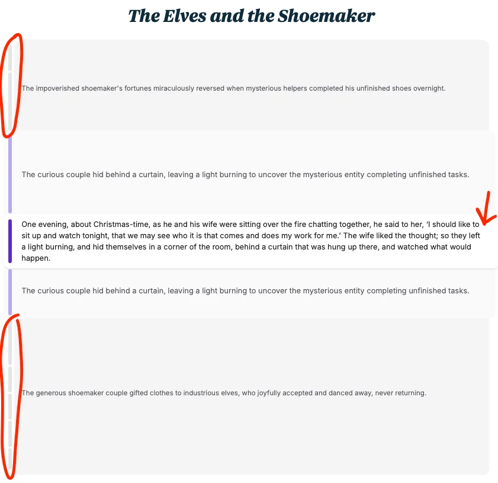

In this article, Amelia proposes applying a fish eye lens to text (and other media) to provide an interface that lets the user focus on a specific part of the context (the magnified centre) while also preserving some reduced information about the surrounding content (the distorted, “not magnified” part of the picture).

The article exemplifies this with a story.
The story clearly has 10 paragraphs, as indicated by vertical bars on the left of the text.
As you move the mouse across those bars, the paragraph you're hovering expands into the full text.
The paragraphs immediately before and after fold into a single-sentence summary, and the group of all paragraphs before that one, and the group of all paragraphs after that one, are also summarised together into a single-sentence summary.

Screenshot of the story accordion.

Something with this post got me really excited really quickly.
This idea of using a fish-eye lens for educational content seems really promising.
I hope I figure out how to use this well, soon.
