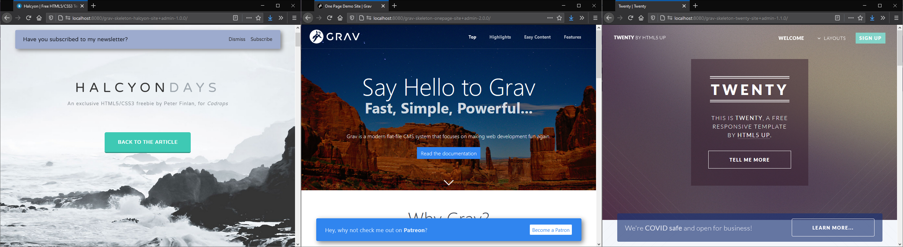

# Custom Banner Plugin

The **Custom Banner** Plugin is an extension for [Grav CMS](http://github.com/getgrav/grav) which adds a custom banner to your Grav site.



## Installation

Installing the Custom Banner plugin can be done in one of three ways: The GPM (Grav Package Manager) installation method lets you quickly install the plugin with a simple terminal command, the manual method lets you do so via a zip file, and the admin method lets you do so via the Admin Plugin.

### GPM Installation (Preferred)

To install the plugin via the [GPM](http://learn.getgrav.org/advanced/grav-gpm), through your system's terminal (also called the command line), navigate to the root of your Grav-installation, and enter:

    bin/gpm install custom-banner

This will install the Custom Banner plugin into your `/user/plugins`-directory within Grav. Its files can be found under `/your/site/grav/user/plugins/custom-banner`.

### Manual Installation

To install the plugin manually, download the zip-version of this repository and unzip it under `/your/site/grav/user/plugins`. Then rename the folder to `custom-banner`. You can find these files on [GitHub](https://github.com/aricooperdavis/grav-plugin-custom-banner) or via [GetGrav.org](http://getgrav.org/downloads/plugins#extras).

You should now have all the plugin files under

    /your/site/grav/user/plugins/custom-banner

> NOTE: This plugin is a modular component for Grav which may require other plugins to operate, please see its [blueprints.yaml-file on GitHub](https://github.com/aricooperdavis/grav-plugin-custom-banner/blob/master/blueprints.yaml).

### Admin Plugin

If you use the Admin Plugin, you can install the plugin directly by browsing the `Plugins`-menu and clicking on the `Add` button.

## Configuration

### Note for Cloudflare/CDN Users
Users of Cloudflare or other cacheing CDNs must enable the "Cloudflare/CDN Fix" option in the plugin configuration.

This adds a `Cache-Control: private` header to all pages that serve the banner, preventing the banner from being served to users who have dismissed it, or failing to be served to users who have not seen it before. There will be a performance penalty associated with this as the CDN will have to request that page from the server every time it is visited, but the CDN should still serve all other assets from its cache.

### Manual Configuration

Before configuring this plugin, you should copy the `user/plugins/custom-banner/custom-banner.yaml` to `user/config/plugins/custom-banner.yaml` and only edit that copy.

Here is the default configuration and an explanation of available options:

```yaml
enabled: true
content: Custom Text added by the <b>Custom Banner</b> plugin (disable plugin to remove)
position: bottom
button-text: Click me...
button-url: /route-to-page/you-want-to/link-to
dismiss-text: Dismiss
dismiss-button: true
cdn-fix: false
bg-colour: '#EC565C'
fg-colour: 'rgba(255, 255, 255, 0.80)'
box-shadow: true
exclude-pages:
  - /route-to-page/you-want-to/exclude
```

You can also overwrite the style defined in `custom-banner/css/custom-banner.css` with your own css rules.

### Admin Plugin

It's much easier to configure the plugin using the Admin Plugin through the plugin settings page. If you use the Admin Plugin, a file with your configuration named custom-banner.yaml will be saved in the `user/config/plugins/`-folder once the configuration is saved in the Admin.

## Usage

To add a banner to your site simply enable the plugin and change the content and colours as required.

## Credits

I pretty much copied the style and format of the premium banner from the [Grav Site](https://getgrav.org/) and just wrapped it up in a plugin for ease of use - so thanks to the Grav Team for doing most of the legwork.

## To Do

- [x] Add a button to make the banner hide-able (for the session? by setting a cookie?)
- [ ] Add more position options, such as left and right
- [ ] Translations (help needed)
