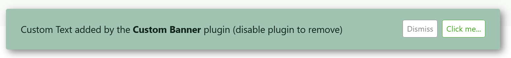

# Custom Banner Plugin

The **Custom Banner** Plugin is an extension for [Grav CMS](http://github.com/getgrav/grav) which adds a custom banner to your Grav site.


## Installation

To install the Custom Banner plugin you need to put its files in the `grav/user/plugins/custom-banner/` directory.

The easiest way to do this is to install the plugin through the Admin plugin which does it all for you, but you can also use the command line Grav Package Manager, or even just do it manually.

### Admin Plugin (Recommended)

If you use the Admin Plugin, you can install the plugin directly by browsing the `Plugins`-menu and clicking on the `Add` button, then searching through the available plugins.

### GPM Installation

To install the plugin via the [GPM](http://learn.getgrav.org/advanced/grav-gpm), through your system's command line, navigate to the root of your Grav-installation, and enter:

    bin/gpm install custom-banner

On some systems you may need to prepend this command with `php `.

### Manual Installation

To install the plugin manually, download the zip-version of this repository and unzip it under `grav/user/plugins`. Then rename the folder to `custom-banner`.

You can find these files on [GitHub](https://github.com/aricooperdavis/grav-plugin-custom-banner) or via [GetGrav.org](http://getgrav.org/downloads/plugins#extras).

## Usage

Once configured and activated this plugin displays a banner on your site, and needs no other intervention.

### Configuration file
Configure the plugin to customise the appearance and behaviour of the banner. It's easiest to configure it through the Admin Plugin, by navigating to `admin/plugins/custom-banner`. This updates the configuration file through an easy to use graphical user interface.

Alternatively you may configure it manually by copying the `grav/user/plugins/custom-banner/custom-banner.yaml` to `grav/user/config/plugins/custom-banner.yaml` and making your changes in that configuration file.

The default configuration file is as follows:

```yaml
enabled: true
content: Custom Text added by the <b>Custom Banner</b> plugin (disable plugin to remove)
position: bottom
button-text: Click me...
button: true
button-url: https://example.com/
dismiss-text: Dismiss
dismiss-button: true
cdn-fix: false
bg-colour: '#A1C3B2'
fg-colour: 'rgba(0, 20, 10, 0.90)'
box-shadow: true
show-on-pages:
hide-on-pages:
  - /route-to-page/you-want-to/exclude
```

Which creates a default banner that looks like this:



### Options
The configuration options can broadly be separated into those that change the plugins appearance, and those that change its behaviour. See the above default configuration for examples of valid configuration values.

#### Appearance
| Option | Type | Description |
| -- | -- | -- |
| `content` | string | The content of the banner. It must be [valid HTML](https://developer.mozilla.org/en-US/docs/Web/Guide/HTML/Content_categories#flow_content) as it is injected directly into a `<div>` within the banner. Generally, the smaller and simpler this is the better it will appear (without manual CSS customisation). |
| `position` | string | Whether the banner appears at the `bottom` or `top` of the screen. |
| `button-text` | string | The text of the action button. It is injected into an `<a>` within the banner so make sure it meets the [permitted content requirements](https://developer.mozilla.org/en-US/docs/Web/HTML/Element/a#properties). |
| `dismiss-text` | string | The text of the dismiss button. It is injected into an `<a>` within the banner so make sure it meets the [permitted content requirements](https://developer.mozilla.org/en-US/docs/Web/HTML/Element/a#properties). |
| `bg-colour` | string | The colour of the banner background. Should be a valid [HTML colour representation](https://developer.mozilla.org/en-US/docs/Web/CSS/color_value). |
| `fg-colour` | string | The colour of the banner content. Should be a valid [HTML colour representation](https://developer.mozilla.org/en-US/docs/Web/CSS/color_value). |
| `box-shadow` | boolean | Whether or not the banner should cast a shadow on the page below it. |

#### Behaviour
| Option | Type | Description |
| -- | -- | -- |
| `button-url` | string | The URL that the action button links to. |
| `show-on-pages` | array of strings | List of routes of pages on which the banner should be exclusively shown (i.e. a whitelist). Leave empty to show the banner on all pages. |
| `hide-on-pages` | array of strings | List of routes of pages on which the banner should be hidden (i.e. a blacklist). Takes priority over the `show-on-pages` value for any given page route. |
| `button` | boolean | Whether an action button is shown or not. |
| `dismiss-button` | boolean | Whether a dismiss button is shown or not. |
| `cdn-fix` | boolean | Enable if a CDN is used for cacheing in-front of the site. This uses client-side javascript for the display logic rather than the default behaviour of server-side logic. |

## Credits

The initial concept was inspired by the premium banner from the [Grav Site](https://getgrav.org/), but the designed has since evolved to improve responsiveness and customisation.

Thanks to all [contributors](https://github.com/aricooperdavis/grav-plugin-custom-banner/graphs/contributors), and those who have [reported bugs](https://github.com/aricooperdavis/grav-plugin-custom-banner/issues?q=is%3Aissue+label%3Abug) and [proposed improvements](https://github.com/aricooperdavis/grav-plugin-custom-banner/issues?q=is%3Aissue+label%3Aenhancement).

## Contributing

- If you use the plugin and have found a bug or would like to see a new feature please [open an issue](https://github.com/aricooperdavis/grav-plugin-custom-banner/issues/new/).
- If you speak multiple languages and could help with translations then please [fork this repository](https://github.com/aricooperdavis/grav-plugin-custom-banner/fork), [add your translations](https://learn.getgrav.org/16/content/multi-language#plugin-and-theme-language-translations) to the `languages.yaml` file, and open a pull request.
- If you are a developer and would like to contribute then please fork, commit, and pull-request as normal - if you don't have any ideas then [the open issues](https://github.com/aricooperdavis/grav-plugin-custom-banner/issues) is a good place to start!
