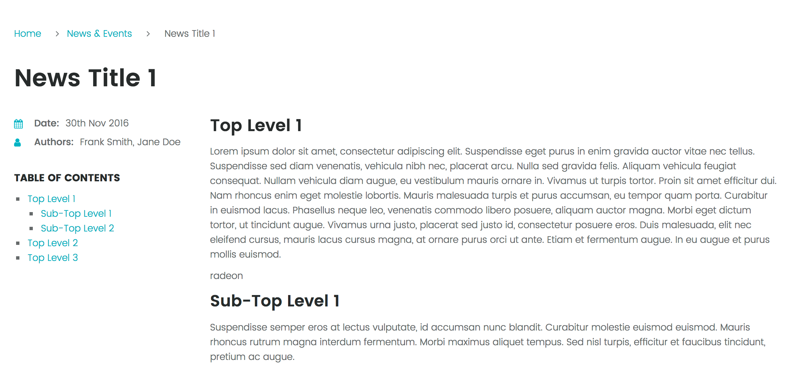

# Page Toc Plugin (Anchors + Table of Contents)

The **Page Toc** Plugin is for [Grav CMS](http://github.com/getgrav/grav) that generates anchors based on HTML header tags, and can also create a table of contents from those headers.

With version `3.0` this plugin is able to automatically generate anchor links with hover-click capability without the need for other plugins (such as the `anchors` plugin).  This functionality operates independently from the now optional "table of contents" functionality.



## Installation

Installing the Page Toc plugin can be done in one of two ways. The GPM (Grav Package Manager) installation method enables you to quickly and easily install the plugin with a simple terminal command, while the manual method enables you to do so via a zip file.

### GPM Installation (Preferred)

The simplest way to install this plugin is via the [Grav Package Manager (GPM)](http://learn.getgrav.org/advanced/grav-gpm) through your system's terminal (also called the command line).  From the root of your Grav install type:

    bin/gpm install page-toc

This will install the Page Toc plugin into your `/user/plugins` directory within Grav. Its files can be found under `/your/site/grav/user/plugins/page-toc`.

### Manual Installation

To install this plugin, just download the zip version of this repository and unzip it under `/your/site/grav/user/plugins`. Then, rename the folder to `page-toc`. You can find these files on [GitHub](https://github.com/team-grav/grav-plugin-page-toc) or via [GetGrav.org](http://getgrav.org/downloads/plugins#extras).

You should now have all the plugin files under

    /your/site/grav/user/plugins/page-toc
	
## Configuration

Before configuring this plugin, you should copy the `user/plugins/page-toc/page-toc.yaml` to `user/config/plugins/page-toc.yaml` and only edit that copy.

Here is the default configuration and an explanation of available options:

```yaml
enabled: true               # Plugin enabled
include_css: true           # Include CSS
active: true                # Anchor IDs processed and generated for all pages
templates:                  # Templates for which anchors should be generated if default is disabled
start: 1                    # Start header tag level (1 = h1) for TOC
depth: 6                    # Depth from start (2 = 2 levels deep) for TOC
hclass:                     # Custom Header TOC styling classes
anchors:                    # Anchor configuration
  start: 1                  # Start header tag level (1 = h1)
  depth: 6                  # Depth from start (2 = 2 levels deep)
  link: true                # Enabled auto-generation of clickable link with fragment
  aria: Anchor              # Aria label to use
  class:                    # Custom Header anchor styling classes
  icon: '#'                 # Icon to use, can be a symbol, emoji, ascii etc.
  position: after           # Position to put the anchor, `before|after`
  copy_to_clipboard: true   # Copy to clipboard functionality (coming soon)
  slug_maxlen: 25           # Max length of slugs used for anchors
  slug_prefix:              # A prefix used in front of generated slugs
```

> You can now have `page-toc` automatically add anchors without there being a table of contents being used, just ensure  `active` to `true`.

By default, The plugin is `active` and will add header id attributes anchors for each header level found in a page.  You can set `active: false` and then activate on a page basis by adding this to the page frontmatter:

```yaml
page-toc:
  active: true
```

Alternatively, you can activate anchor generation on all pages using a given set of `templates`.

You can also configure which header tags to start and depth on when building the id attribute anchors by changing the `start` and `depth` values. This can also be done on a per-page basis.

For example if you had a start of `3` and a depth of `3` you would get a TOC for `h3`, `h4`, and `h5`.

## Usage

### Shortcode-like syntax in your content

You can use the following shortcode-like syntax in your content:

```md
[TOC] or [TOC/] or [toc] or [toc /]
```

This will replace the shortcode syntax with the Table of Contents with the `components/page-toc.html.twig` Twig template. Either the default one included in the `page-toc` plugin or an overridden version from your theme.

For example in Quark theme, you will need to create a folder called `components/` under `templates/` so the file will be copied to:

```shell
user/themes/quark/templates/components/page-toc.html.twig
```

NOTE: It's not required to set the TOC plugin `active` if you use the shortcode syntax in your content.  That is a good enough indication that you want the plugin to be active.

### Customizing specific anchors

There are situations where you want to have absolute control over the exact anchor link rather than letting page-toc create one for you.  The best way to achieve this is to add your own `id` attribute to the header tag.  This can be done either via HTML in your markdown directly:

```html
<h2 id="my-custom-anchor">H2 Header</h2>
```

Or via using the header shortcodes.  This approach is particularly useful if you have markdown inside your header tag:

```markdown
[h2 id="my-custom-anchor"]H2 _header_[/h2]
```

If an `id` is found in one of the header tags that page-toc is configured to use for anchors, then it will use the provided value for the anchor id.

### Anchor Shortcode

Page TOC now includes a `anchor` shortcode that allows you to manually add linkable fragments in your content.  
The shortcode will automatically generate the link if no options are provided. Alternatively you can use the BBCode syntax of `anchor="some-custom-id"` or you can explicity set it.  You can also set a `prefix` and let the shortcode autogenerate the rest.

For example:

```markdown

Ut sed nisl suscipit metus sollicitudin [anchor]<span>ornare</span>[/anchor] nec vitae nulla. In pretium massa ex, in [anchor="vulputate"]vulputate tellus[/anchor] accumsan vel. 

Nullam [anchor id="tempor"]tempor quis lorem[/anchor] venenatis finibus. Curabitur dapibus nulla sed tristique pretium. Nullam tempor quis [anchor prefix="sec2.2-"]lorem venenatis finibus[/anchor].
```

An example of the resulting HTML link looks like:

```html
<a id="tempor" href="#tempor" class="inline-anchor" aria-label="Anchor">tempor quis lorem</a>
```

The `inline-anchor` CSS class is used by shortcodes and any manually generated elements so it can be styled as independently from other links or anchored headers.
 
### Twig Templating

When the plugin is `active` it will add anchors to the header tags of the page content as configured. You can simply include the provided Twig template:

```twig

	
	{{  content|raw }}

```

You can also add your **Table of Contents** HTML in your Twig template directly with the provided `toc()` Twig function:

For example:

```twig

<div class="page-toc">
    
    
    <h4>{{ 'PLUGIN_PAGE_TOC.TABLE_OF_CONTENTS'|t }}</h4>
    {{ table_of_contents|raw }}
    
</div>

```

The `toc_ordered()` Twig function does the same things as a the `toc()` function, except it uses an ordered list instead of an unordered one.

or via the `toc_items()` function which rather than returning HTML directly returns objects and you can manipulate the output as needed:

```twig

    
    
        
        <li class="{{ class }}">
            <a href="{{ item.uri }}">{{ item.label }}</a>
            
                <ul>
                    {{ _self.toc_loop(item.children) }}
                </ul>
            
        </li>
    



<div class="page-toc">
    
    
        <h4>Table of Contents</h4>
        <ul class="page-toc">
            {{ _self.toc_loop(table_of_contents.children) }}
        </ul>
    
</div>

```

To explictly build a table of contents for a block of content:

```markdown

# Header 1

## Header 1.1

Nullam tempor quis lorem venenatis finibus. Maecenas ut condimentum nibh. Ut sed nisl suscipit metus sollicitudin ornare nec vitae nulla. Integer sed tortor eu ligula interdum rhoncus. Sed pulvinar ut massa et ullamcorper. Curabitur bibendum ante orci, nec porttitor dolor suscipit quis. Nulla et eros enim. 

### Header 1.1.1

Integer sed tortor eu ligula interdum rhoncus.

## Header 1.2


#### Table O' Contents
{{ toc(block('my_content'), 2, 1) }}
```

The `add_anchors()` twig funtion can take a string or a block of content and automatically adds anchors to any headers found per the configuration for the page, but you can override the start and depth. For example here we have a Twig block but we just want to add anchors to the H2 tags:

```markdown

# Header 1

## Header 1.1

Nullam tempor quis lorem venenatis finibus. Maecenas ut condimentum nibh. Ut sed nisl suscipit metus sollicitudin ornare nec vitae nulla. Integer sed tortor eu ligula interdum rhoncus. Sed pulvinar ut massa et ullamcorper. Curabitur bibendum ante orci, nec porttitor dolor suscipit quis. Nulla et eros enim. 

### Header 1.1.1

Integer sed tortor eu ligula interdum rhoncus.

## Header 1.2


#### Anchors Away!
{{ add_anchors(block('my_content'), 2, 1) }}
```

### Limiting levels in output

As well as limiting the levels that the page TOC plugin will use in the table of contents, you can also limit the levels that are actually displayed. To do this you can pass an optional `start`, and `depth` value to the `toc()`, `toc_ordered()` , `toc_items()` and `add_anchors()` Twig functions:

```twig

```

This will only display `H3` , and **3** levels deeper (up to `H5`) in the TOC output.

## Credits

The majority of this plugin's functionality is provided by the [PHP TOC Generator](https://github.com/caseyamcl/toc) library by [Casey McLaughlin](https://github.com/caseyamcl). So Thanks for making this plugin for Grav possible!


